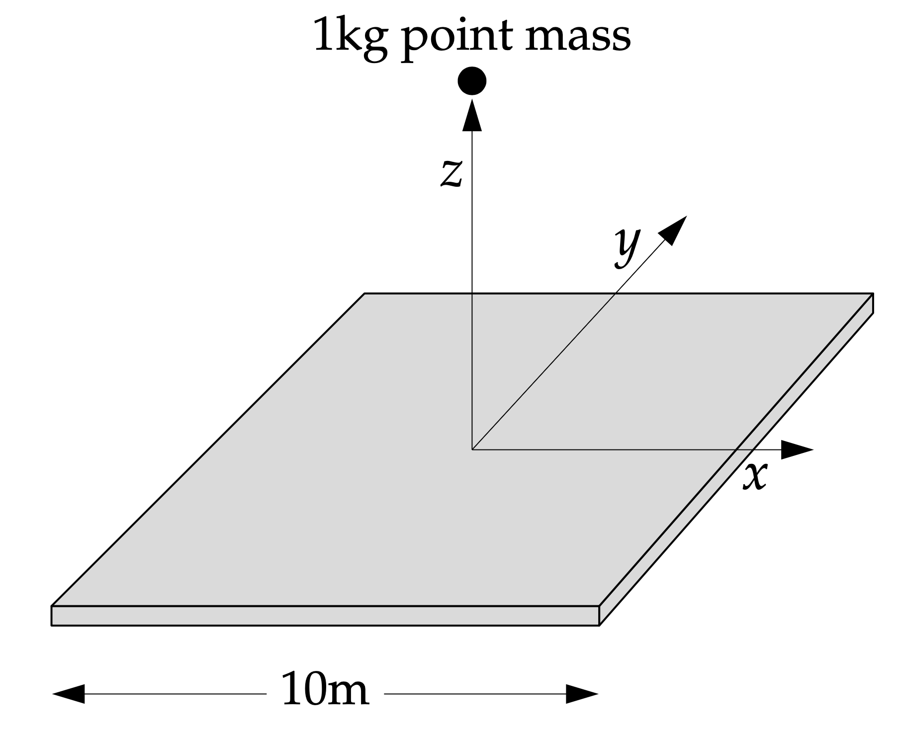

# 第 6 周实验：数值积分与物理场重建（A/B/C + Bonus）

## 🎯 实验目标

本周不再重复第 1 周的中心差分与 Richardson 基础训练，改为聚焦“积分方法 + 物理解释 + 数值稳定性”。

- 任务 A：核反应率温度敏感性指数
- 任务 B：梯形法 vs Simpson 法（含 Debye 积分）
- 任务 C：均匀带电圆环电势场
- Bonus：方板引力场（二维积分挑战）

---

## 🧩 分值结构（主任务 70 + Bonus 30）

| 模块 | 内容 | 分值 |
|---|---|---:|
| Task A | 3-α 反应率温度敏感性指数 ν | 23 |
| Task B | 梯形法/Simpson 法比较 + Debye 热容积分 | 24 |
| Task C | 带电圆环电势场计算与可视化 | 23 |
| Bonus | 方板引力场（二维积分） | 30 |

说明：A/B/C 为并行主任务，无主次任务。

---

## 👥 小组协作建议（3 人并行）

| 角色 | 建议负责文件 |
|---|---|
| Member A | `lab1_core/src/task_a_nuclear_sensitivity.py` |
| Member B | `lab1_core/src/task_b_integration.py` |
| Member C | `lab1_core/src/task_c_ring_potential.py` |

Bonus 可由全组协作完成：`lab2_bonus/src/bonus_plate_gravity.py`

---

## Task A（23分）：3-α 反应率温度敏感性指数

文件：`lab1_core/src/task_a_nuclear_sensitivity.py`

### A.1 物理背景（先读懂再写代码）

恒星中 3-α 反应的温度依赖非常强。忽略密度与组分因子后，其温度相关部分可写作：

$$
q(T)=5.09\times10^{11}T_8^{-3}e^{-44.027/T_8},\quad T_8=T/10^8
$$

我们希望把复杂关系在某个参考温度 $T_0$ 附近近似为幂律：

$$
q(T)\approx q_0\left(\frac{T}{T_0}\right)^\nu
$$

这里的 $\nu$ 叫“温度敏感性指数”，定义为：

$$
\nu=\left.\frac{d\log q}{d\log T}\right|_{T_0}
=\left(\frac{T}{q}\frac{dq}{dT}\right)_{T_0}
$$

它的物理含义是：温度发生相对变化时，反应率会被放大多少倍。  
$\nu$ 越大，系统越“点火敏感”。

### A.2 数值方法要求

你需要用前向差分近似 $dq/dT$ ：

$$
\frac{dq}{dT}\bigg|_{T_0}\approx
\frac{q(T_0+\Delta T)-q(T_0)}{\Delta T},\quad \Delta T=hT_0
$$

建议默认 $h=10^{-8}$（平衡截断误差与舍入误差）。

### A.3 你要完成的函数（必须）

1. `rate_3alpha(T)`：输入开尔文温度 `T`, 返回 $q(T)$ ；
2. `finite_diff_dq_dT(T0, h)`：返回 $dq/dT$ 的前向差分近似；
3. `sensitivity_nu(T0, h)`：返回 $\nu(T_0)$ ；
4. `nu_table(T_values, h)`：返回 `[(T0, nu0), ...]`。

### A.4 必算温度点与输出格式

请至少计算以下温度：

`[1.0e8, 2.5e8, 5.0e8, 1.0e9, 2.5e9, 5.0e9]`

建议输出格式：

`1.000e+08 K : nu = 41.03`

### A.5 结果自检（用于判断程序是否靠谱）

若实现正确，$\nu$ 大致趋势应为：

- $T_0=10^8$ K 附近：$\nu$ 很大（约 41）；
- 随温度升高：$\nu$ 显著降低；
- 高温端可能出现负值（约 $-1$ 到 $-2$ 量级）。

你的结果不必逐位一致，但数量级与趋势应一致。

### A.6 常见错误（扣分高发）

- 把 `h` 当作绝对增量，而不是 `h*T0`；
- 误写 `T8 = T/10^8` 导致指数项错误；
- `nu = (T/q) * dq/dT` 中把 `q(T0)` 写成 `q(T0+dT)`；
- 没有检查 `T>0` 与数值溢出。

---

## Task B（24分）：梯形法 vs Simpson 法 + Debye 热容积分

文件：`lab1_core/src/task_b_integration.py`

Debye 模型把固体热容看作晶格振动模态的累积贡献，这本质上是一个“态密度加权积分”问题。  
当温度从低温升到高温时，积分上限 $y=\theta_D/T$ 改变，热容会呈现典型的低温 $T^3$ 行为并在高温趋于常数。

Debye 积分核：

$$
I(y)=\int_0^y\frac{x^4e^x}{(e^x-1)^2}dx,\quad y=\theta_D/T
$$

你需要完成：

1. 复合梯形积分 `trapezoid_composite`；
2. 复合 Simpson 积分 `simpson_composite`（要求偶数分段）；
3. 实现 `debye_integral(T, theta_d, method, n)`；
4. 比较两种方法在相同 n 下的误差差异。

---

## Task C（23分）：均匀带电圆环电势场

文件：`lab1_core/src/task_c_ring_potential.py`

计算并可视化一个半径为 $a$ 、总电荷为 $Q = 4\pi\varepsilon_0 q$ 的均匀带电细圆环在空间中产生的电势和电场。

圆环电势（设 $a=1,q=1$ ）：

$$
V(x,y,z)=\frac{q}{2\pi}\int_0^{2\pi}\frac{d\phi}{\sqrt{(x-a\cos\phi)^2+(y-a\sin\phi)^2+z^2}}
$$

你需要完成：

1. 实现 `ring_potential_point(x, y, z, a=1.0, q=1.0)`；
2. 实现 `ring_potential_grid(y_grid, z_grid, x0=0.0, a=1.0, q=1.0)`；
3. 计算 yz 平面的电势分布（画出等势线图）。
4. 在该平面上使用 **箭头** (`plt.quiver`) 或 **场线** (`plt.streamplot`) 表示 **电场矢量** 分布。
---

## 🚀 Bonus（30分）：方板引力场（二维积分挑战）

文件：`lab2_bonus/src/bonus_plate_gravity.py`

我们考虑一个质量均匀分布的正方形金属板，它漂浮在空中并保持静止。



*   金属板边长 $L = 10 ~ \text{m}$
*   金属板厚度可以忽略
*   金属板总质量 $M_{plate} = 10 ~ \text{吨} = 10^4 ~ \text{kg}$

我们需要计算的是，在该正方形金属板中心垂直正上方距离 $z$ 处，一个质量为 $m_{particle} = 1 ~ \text{kg}$ 的质点所受到的万有引力。具体来说，我们关注引力沿 $z$ 轴方向的分量 $F_z$ 。该力可以表示为：

$$
F_z(z) = G \sigma m_{particle} z \iint_{-L/2}^{L/2} \frac{dx ~ dy}{(x^2+y^2+z^2)^{3/2}}
$$

其中：
*   $G = 6.674 \times 10^{-11} ~ \text{m}^3 ~ \text{kg}^{-1} ~ \text{s}^{-2}$ 是万有引力常数。
*   $\sigma = M_{plate} / L^2$ 是金属板单位面积的质量（面密度）。
*   $m_{particle} = 1 ~ \text{kg}$ 是测试质点的质量。 (您的代码中，此值默认为1kg，力以牛顿为单位)。

你需要完成：

1. 实现高斯-勒让德二维积分 `gauss_legendre_2d`；
2. 实现 `plate_force_z(z, L, M_plate, m_particle, n)`；
3. 对 `z∈[0.2,10]` 的结果进行计算。

---

## 🧪 自动测试

```bash
pip install -r requirements.txt
python -m unittest discover -s lab1_core/tests -p "test_*.py" -v
python -m unittest discover -s lab2_bonus/tests -p "test_*.py" -v
```

---

## 📝 提交要求

1. 完成 `src/` 中所有 TODO；
2. 不要修改 `tests/` 与 `.github/workflows/`；
3. 填写 `Report_Template.md`，包含：
   - 方法对比表；
   - 至少 1 张图（Task C 或 Bonus）；
   - AI 代码审查记录。
